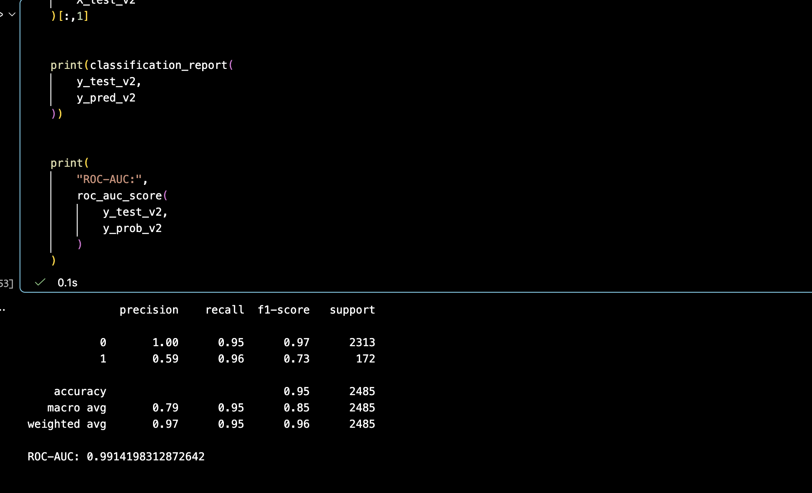
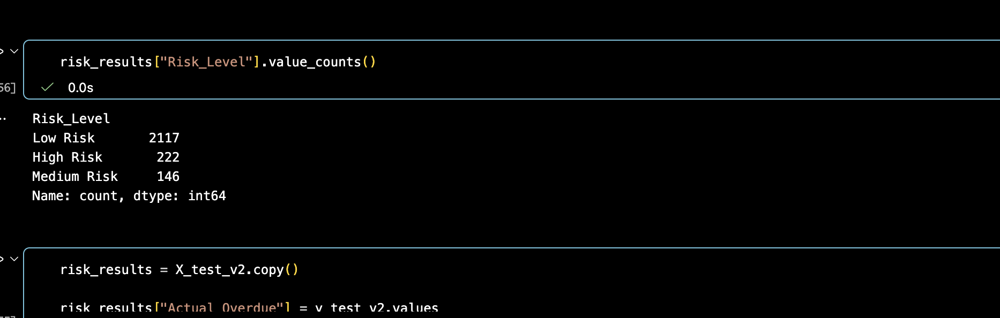
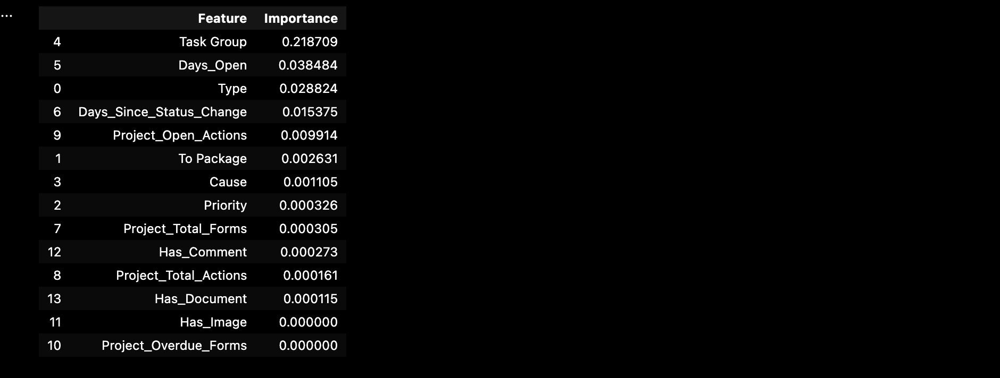

# Intelligent Construction Project Risk Prediction System

## Overview

A machine learning-based early warning system designed to predict construction project risks before they escalate.

The project combines operational project data, task performance indicators, and machine learning models to identify high-risk activities, forecast potential delays, and support proactive project decision-making.

Although developed in a construction risk environment, the analytical approach mirrors real-world applications in financial risk, credit risk, and operational risk analytics.

---

## Business Problem

Construction projects often experience delays due to issues that are detected too late.

Traditional reporting methods rely on historical information and manual monitoring, making it difficult to identify emerging risks early.

This project builds a predictive risk intelligence system that:

- Identifies tasks likely to become overdue
- Predicts project delay risk
- Generates risk categories for intervention
- Highlights key drivers contributing to risk

---

## Solution

Built an end-to-end machine learning pipeline that:

1. Processes construction project operational data
2. Engineers risk-related features
3. Trains classification models to predict overdue tasks
4. Generates risk scores and risk categories
5. Provides explainable insights through feature importance analysis

---

## Machine Learning Approach

### Model

- XGBoost Classification Model

### Problem Type

Binary classification:

- High risk / overdue task prediction
- Low risk / non-overdue task prediction

### Evaluation

Model performance:

- ROC-AUC: 0.99+
- Precision/Recall evaluation for minority risk class
- Risk segmentation into:

  - Low Risk
  - Medium Risk
  - High Risk

---

## Key Risk Drivers

The model identified the following factors as important predictors of project risk:

- Task Group
- Days Open
- Task Type
- Time Since Status Change
- Open Project Actions

---

## Business Impact

The system enables:

- Earlier identification of project delays
- Data-driven risk prioritisation
- Improved operational monitoring
- Better allocation of project resources

The same modelling principles are applicable to:

- Credit risk prediction
- Operational risk management
- Fraud detection
- Financial forecasting

---

## Tech Stack

Python  
Pandas  
NumPy  
Scikit-learn  
XGBoost  
Matplotlib  
Jupyter Notebook  
SQL

---

## Project Structure

---

## Model Insights

### Risk Prediction Performance

### Risk Distribution

### Feature Importance

---

## Future Improvements

Potential extensions:

- Time-series forecasting of project completion dates
- Automated dashboard deployment
- Cloud-based model serving
- Real-time risk monitoring pipeline